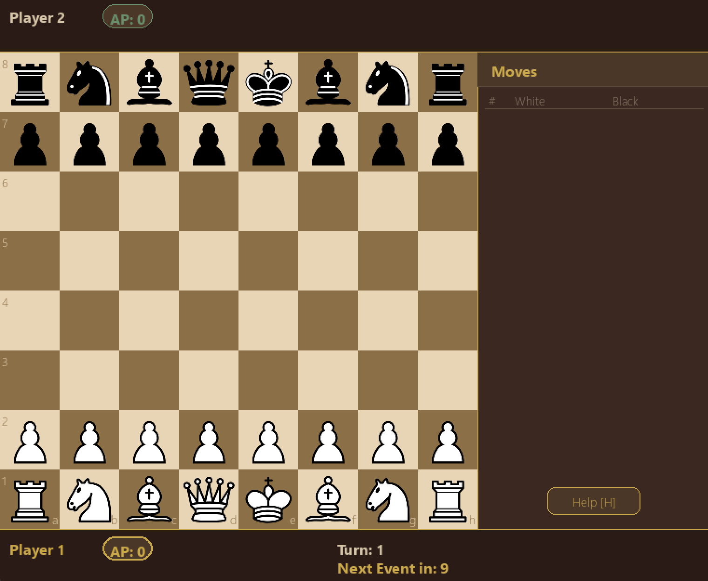

# OnlyChess

Standard chess — until a capture fuses two pieces into something new, and a global event
turns the board upside down ten moves later.



OnlyChess is a Python/Pygame chess variant built for an Object-Oriented Programming course
project. It keeps the base game fully standard-chess-legal, then layers on capture-triggered
**fusion**, resource-gated **active abilities**, and periodic **global events** that force both
players to adapt mid-game.

## What Makes It Different

- **Fusion:** capture the right piece with the right piece and the capturer transforms into a
  hybrid — an Archbishop, Chancellor, Warden, or Inquisitor — with the combined movement of both
  components. Fusion is automatic and permanent until the fused piece is captured.
- **Action Points & Abilities:** every player earns Action Points over time and can spend them
  on active skills — swap a Knight with an ally, snipe a piece with a Bishop without moving,
  shield a cluster of pieces, or sprint a Pawn three squares.
- **Global Events:** every 10 full turns, a random event resolves — meteor strikes, mass
  transformations, dice-roll piece removal, and more. A warning fires one turn ahead so players
  can brace for it.

## Core Mechanics

### Fusion Pairs

| Capturing Piece | Captured Piece | Result | Movement |
|---|---|---|---|
| Knight | Bishop | **Archbishop** | Knight + Bishop |
| Rook | Knight | **Chancellor** | Rook + Knight |
| Rook | Bishop | **Warden** | Unlimited orthogonal + diagonal up to 3 |
| Bishop | Rook | **Inquisitor** | Unlimited diagonal + orthogonal up to 3 |

### Action Points & Abilities

Abilities cost Action Points (AP) and consume the player's entire turn. AP is gained
automatically over time (max 5), never from captures.

| Ability | Cost | Effect |
|---|---|---|
| Knight's Swap | 2 AP | Swap the Knight with any friendly piece, anywhere on the board |
| Bishop's Snipe | 3 AP | Remove an enemy piece along the Bishop's diagonal without moving |
| Rook's Shield | 3 AP | Grant the Rook and adjacent allies immunity to capture/destruction for one turn |
| Pawn's Sprint | 1 AP | Move a Pawn 3 squares forward, jumping over other pieces |

### A Few Global Events

Events trigger every 10 full turns, with a one-turn warning beforehand. A sample from the pool:

| Event | Effect |
|---|---|
| Umamusume | Every piece except Kings permanently becomes a Knight |
| Mỹ đánh Iran (Meteor Strike) | A random 2×2 zone is warned, then everything inside is destroyed |
| Tài Xỉu | A coin flip removes one random piece from a random side |
| Người Chồng Bất Lực | Both Kings are immobilized for a turn — check becomes deadly |

## Getting Started

### Download & play (no clone needed)

The easiest way to play is to grab the packaged build from the
[**GitHub Releases**](../../releases) page — just download the latest release and run the game
directly, no cloning or Python setup required.

### Run from source

Requires Python and [`uv`](https://github.com/astral-sh/uv).

```bash
uv run python run.py
```

Compatibility entrypoint (forwards to the same `src.main.main()`):

```bash
uv run python main.py
```

## Architecture & OOP Design

OnlyChess is organized around a central `GameState`, but `GameState` does not own every rule —
it coordinates focused collaborators instead:

| Package | Responsibility |
|---|---|
| `src/game/` | Board state, move legality, move execution, rollback, ordered post-move systems |
| `src/pieces/` | `Piece` base class plus standard and fused piece subclasses |
| `src/events/` | `ChessEvent` base class, concrete events, event registry, `EventManager` (timing) |
| `src/fusion/` | Capture-pair rule table and `FusionManager` (resolution) |
| `src/abilities/` | `Ability` base class, concrete abilities, ability registry |
| `src/ui/` | Pygame rendering, input handling, menus — reads game state, never decides rules |

**Inheritance** gives pieces, events, and abilities a shared contract (`Piece`, `ChessEvent`,
`Ability`) wherever the game naturally has one. **Composition** lets `GameState` delegate to
focused helpers — `EventManager`, `FusionManager`, `ActionPointTracker`, `CaptureTracker`,
`ShieldTracker` — instead of absorbing their logic. **Registries** create pieces, events, and
abilities from stable string keys, avoiding long conditional chains.

Move execution runs through an ordered list of post-move systems (capture tracking → fusion →
AP gain → shield expiry → event ticking), so new post-move mechanics slot in as one more system
rather than a new branch in `GameState`.

## Extensibility

The goal is that most new features are additive, not invasive:

- **New event** — add a `ChessEvent` subclass, register it, add it to the event pool.
- **New ability** — add an `Ability` subclass and register it.
- **New fusion pair** — add an entry to the fusion rule table.
- **New fused piece** — add a piece class, registry entry, fusion rule, and tests.
- **UI-only change** — edit `src/ui/` without touching gameplay rules.

Honest limits: new piece identities still need constants, new persistent state may need a
`GameState` field, and mechanics touching both moves and ability turns need care around
`GameState.finish_ability_turn()`.

## Tech Stack

Python, Pygame, `uv`.

## Credits / Assets

- Chess piece sprites (including standard and fused variants) are sourced from [GreenChess](https://greenchess.net/info.php?item=downloads).
