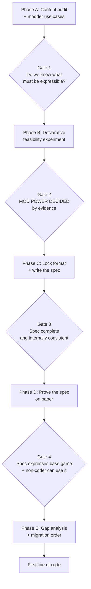

# Preparation Roadmap: Mod-Driven OnlyChess

**Status:** preparation phase. No implementation code until Gate 4.
**Goal of this phase:** produce a spec that provably expresses the existing game, so the refactor
has a target instead of a direction.

---

## ▶ START HERE — current status

**Last updated:** 2026-07-17 · branch `refactor/mod-driven-prep`

### Where we are

| Phase | State |
|---|---|
| **A** — audit + use cases | ✅ complete → [`content-audit.md`](content-audit.md), [`use-cases.md`](use-cases.md) |
| **Gate 1** | ✅ passed |
| **B** — feasibility experiment | ✅ complete → [`feasibility-study.md`](feasibility-study.md) |
| **Gate 2** | ✅ passed — mod power decided by evidence |
| **C** — lock format + spec | ✅ **complete — 6 of 6** |
| C1 format | ✅ [ADR-001](adr/001-data-format.md) — YAML, pinned to 1.2 core schema |
| C2 mod package | ✅ [spec/mod-package.md](spec/mod-package.md) — manifest, IDs, semver, load order |
| C3 content schemas | ✅ [spec/content-schemas.md](spec/content-schemas.md) — 6 content types, 3 vocabularies |
| C4 loader lifecycle | ✅ [spec/loader-lifecycle.md](spec/loader-lifecycle.md) — 9 stages + error contract |
| C5 conflict semantics | ✅ [ADR-002](adr/002-conflict-semantics.md) — addressable + 3 patch ops |
| C6 status model | ✅ [spec/status-model.md](spec/status-model.md) — statuses as data |
| **Gate 3** | ✅ **passed** — 9 defects found and fixed; see below |
| **D** | 🔶 in progress — 1 of 3 |
| D1 base mod on paper | ✅ [`mods/`](../../mods/) — 34 files → [d1-findings.md](d1-findings.md) |
| D2 base mod granularity | ✅ decided at Gate 1: split. Boundaries proved by D1 |
| D3 non-coder test | ⬜ **← NEXT.** Needs a person; see "Waiting on the human" |
| **Gate 4** | ⬜ blocked on D3 |
| **E** | ⬜ not reached |

Decisions closed: D1–D10. D8 (versioning) is settled by `mod-package.md`'s Versioning section, and
Gate 3 completed it — a mod now has an `id`, which is what MAJOR and dependency keys were implicitly
about. D9's verb set was **reopened by D1 and re-closed**: nine content types (`resource` added), the
message templates cut to two, `fuses_on` and `origin` added. Retired: D11.

### Do this next: D3 — and it needs a person

**D1's eight gaps are all closed or consciously parked**, and both decisions that needed a human have
been made. **Nothing else in Phase D is blocked, and nothing is blocked on the spec.** D3 is the only
thing between here and Gate 4, and it cannot start without a non-coder to hand the guide to.

Two decisions taken after D1, both worth not relitigating:

- **`credit` does not trigger fusion — displacement does.** `type: fusion` gains
  `fuses_on: displacing_captures`. Preserves today's behaviour exactly: `bishop_snipe` emits a
  capture but never moves, so it does not fuse. The decision had to live in `base:fusion` regardless,
  because `base:chess` cannot reference it (UC11). It is also **ADR-002's first plausible base-game
  patch target**, after C3 looked for one and found none.
- **The AP economy becomes a `resource` content type** (`base:ap`, nine content types now). The
  tuning gap was the visible reason; the real one is that **`cost: { ap: 3 }` was a prime-directive
  violation** — a content identifier as a literal key in a core schema. Now `cost: { base:ap: 3 }`,
  and `mymod:mana` works on day one. Note what is *not* in it: "using an ability ends your turn" is
  the turn lifecycle, which is core's job, not tuning.

Known gaps carried past Gate 3 — all deliberate, all recorded. A gap is not a gate failure if it is
written down and owned:

| Gap | Where | Status |
|---|---|---|
| Event triggers (F5) | content-schemas | Deferred out loud; v1 is pool-invoked only |
| **Player choice** (promotion) | content-schemas, finding 2 | **Real gap.** Needs a move-pipeline home |
| ~~`credit` → fusion?~~ | content-schemas | ✅ **decided after D1:** `fuses_on: displacing_captures` |
| Board layout selection | loader-lifecycle | Needs an owner in Phase D |
| `.lc` position mapping | loader-lifecycle | **Unspiked; highest-risk unknown** |
| Validation library | loader-lifecycle | Deliberately deferred to ADR-003 (Phase E) |

### D1 is done — what it found

Read [d1-findings.md](d1-findings.md). The spec **expresses the base game** — after eight gaps, two
of which needed the decisions above. 34 files in [`mods/`](../../mods/): 3 manifests, 10 pieces,
4 abilities, 10 events, 1 pool, 1 fusion table, 3 statuses, 1 board layout, 1 resource.

**ADR-001's Norway problem is now confirmed in our own content, not argued.** `pyyaml` is installed
here, so stock-PyYAML parsing of `pieces/pawn.yaml` is testable: `on:` parses as the boolean `True`
and **the pawn's promotion rule silently disappears**. Valid YAML, different meaning, no error. The
1.2 pin is load-bearing exactly as ADR-001 claimed, and the chokepoint must *reject* PyYAML rather
than merely avoid it.

**All three transcription hazards fired, and all three were caught by the spec having written them
down** — Warden's `limit=4`, the pawn's `has_moved` divergence, fusion's `captured: primary`. That is
what the hazard boxes were for, and it is the strongest evidence so far that writing the spec before
the engine was the right call.

**The two selector axes paid off three times.** `gia_xang_tang`'s hand-enumerated list became
`primary: base:rook`; `kho_ga_tron_ba_mia`'s seven codes became
`tag_any: [base:rook, base:knight, base:bishop]` — *exactly* that set, verified piece by piece. And it
compounds: because events reach fused pieces through `components` rather than by ID, **`base:events`
needs no dependency on `base:fusion` at all**. That is D2's boundary proved rather than asserted.

**The pattern in the gaps is worth more than the gaps.** Gap 2 and gap 3 are both places where the
verb was written from *the audit's one-line summary* of an event rather than from the event —
"random 2×2 zone" and "compact notation per effect" are accurate descriptions and insufficient
specifications. Anything else derived that way is suspect. This is exactly what D1 is for: it is
cheap here, and it would have been a schema rewrite three weeks into an engine.

**The dogfooding claim is still unproven.** `base:chess`'s `code/` is not written, because Gate 4
forbids implementation code and the verbs (`castle`, `enpassant`) are code. D1 tests the data side
only.

### Gate 3 is done — what it found

Completeness passed as written: every capability in the Phase A surface has a home, and
[content-schemas](spec/content-schemas.md)' checklist held up under review rather than needing redoing.

**Consistency did not pass — it found nine defects**, all now fixed. The pattern is worth keeping in
mind for D1: **every one was an omission, not a wrong decision.** No verb was unearned, no rule was
wrong; what was missing was the sentence saying so. Unstated conventions are invisible to the author
who is holding them in their head, and nothing surfaces them except reading six documents against
each other in one pass. Three would have stopped the base mod from loading at all.

**The blocker — mod identity was never modelled** (fixed in [mod-package](spec/mod-package.md)).
The manifest declared a `namespace` and no id, while dependencies, disable chains, and every error
message named mod ids like `base:chess` that no field produced. Underneath sat a real contradiction:
one namespace per mod, plus a hard error on collision, made **D2's three base mods illegal** —
`base:chess`, `base:fusion`, and `base:events` all define `base:*` IDs. The split UC11 required could
not load. Resolved:

- **A mod's id is a namespaced ID like everything else** (`id: base:chess`), and its namespace is the
  id's namespace part. One field, derived, not two declared.
- **The originator rule:** several mods may claim a namespace only if exactly one of them is a
  dependency of all the others. `base:chess` originates `base`. Two strangers both claiming
  `dragonmod` still hard-error, so the property the strict rule protected is intact. The check is
  free — stage 2 already has the resolved graph.
- **Rejected:** per-mod namespaces (`base_chess:queen`). It bakes our packaging into every ID a third
  party references, so moving `shield` between base mods would break dependents. The partition is our
  business; the namespace is the ecosystem's.
- **Knock-on:** load-order ties now break by **mod id**, not namespace — which is no longer unique.
- **Bonus:** it resolves a tension nobody had flagged. `replace` cannot work by redefining
  `base:queen`, since a mod may only define IDs in its own namespace. A total conversion defines
  `mymod:queen` with `replaces: base:queen`, and the file now says outright what it does and to whom.

**Two more that stopped the base mod loading.** Statuses had no `type:` and were absent from the
content-type list, so every status file failed at stage 3 — `status` is a content type, it just lived
in another document and nobody reconciled the two. Patches had the same problem, and ADR-002's third
mode `replace` was decided but had no stage and no syntax; it is now a `replaces:` field, applied at
stage 6 before patches so a patch cannot silently land on a definition that is about to be discarded.

**The rest were spec-internal drift**, all in [content-schemas](spec/content-schemas.md): effects
named their subject four different ways (now one defaulting `target:`); `type: step` was used by the
King and never defined (deleted — a king is `slide` with `limit: 1`, and `_get_one_step_moves` is an
implementation of that, not a second primitive); piece triggers had no vocabulary despite `trigger`
being the first term of the project's own shape (now vocabulary 1, one entry — `moved`); one ability
wrote `when: { self: {…} }` against bare conditions everywhere else (the subject is always implicit,
and letting a condition name another subject is where the condition line would break first); and
`pick: all` vs `pick: { random: 1 }` was a convention used by four fields and stated by none.

**One silent-breakage bug found, in the fix for another one.** C3's hazard box says `limit` is off by
one and the loader converts it. `base:poison` carries `movement.slide.limit: 1` — the same unit, a
different schema. A loader that normalizes only `moves` gives a poisoned bishop a **zero-square
slide**, with nothing in the data looking wrong. Normalization is now defined over the **vocabulary**,
not the piece type. This is exactly the failure C3 wrote the hazard box to prevent, hiding one
document over.

### C4 is done — what it decided, and what it found

Read [spec/loader-lifecycle.md](spec/loader-lifecycle.md). Nine stages: discover → resolve → parse →
load code → validate → patch → register → link → activate.

**The roadmap's own pipeline sketch was in the wrong order.** It has *validate* before *resolve*.
That is not a style preference — it is impossible:

> Validation needs the verb vocabulary → the vocabulary is not complete until code mods have
> registered their verbs → code mods must run in dependency order → dependency order comes from
> resolve.

Validating earlier checks content against a vocabulary still missing verbs, and every `castle:` in
`base:chess` fails as an unknown key. Worth flagging because **the naive order fails only for code
mods** — it would pass every test written against `base:chess` alone, until the first third-party
verb. Two smaller ordering constraints: parse before running anyone's Python (the only free safety a
trusted-local-install model offers), and patch before normalize (ADR-002 targets *author-facing*
field names, so `limit: 3` must land before the off-by-one conversion).

Other decisions worth not relitigating:

- **All errors collected and reported together, not fail-fast.** A non-coder with six typos should
  not run the game six times to find them one at a time.
- **Report the root, not the cascade.** One typo in `base:chess` disables it, disables `base:fusion`
  and `base:events` transitively, registers zero board layouts, and stops the game — four errors, one
  cause. Leading with "no board layouts registered" sends the modder to the wrong file.
- **The engine requires ≥1 board layout, never `base:chess` by name.** Core may not name a mod, and
  a total conversion (UC12) replaces `base:chess` and must still boot.
- **The vocabulary freezes at stage 4** and nothing may register a verb afterward.

**The C4 finding that changes the research backlog:** the *pydantic v2 vs jsonschema* question is
framed on the wrong criterion. Error quality can't decide it, because **we write our own message
layer either way** — jsonschema's `anyOf` errors are unusable for this audience and pydantic's are
still Python-shaped. What actually bites is (a) **source positions**, which neither library provides
— `file:line:col` has to come from the parser retaining `ruamel`'s `.lc` data through validation,
which is architecture rather than a flag; and (b) **the vocabulary is runtime-extensible**, so
`effect` is a discriminated union over a registry that doesn't exist at import time — which both
libraries are bad at and the verb registry already solves, since by stage 4 it *is* a schema. A
registry-driven validator is a third option the backlog doesn't list. **Deferred to ADR-003 in Phase
E, deliberately**, because the `.lc` spike is a real input and deciding without it is vibes.

### C3 is done — what it decided, and what it found

Read [spec/content-schemas.md](spec/content-schemas.md). It specifies **piece, event, event pool,
ability, fusion, board layout** plus the shared **selector / condition / effect** vocabularies.

Headline decisions, each of which a fresh session should not relitigate without reading the file:

- **`components: [base:rook, base:bishop]`** — one ordered field yields *both* selector axes.
  `tag_any` tests membership, `primary` tests the first element. This is F3 resolved at the root:
  the principle *is* the query, so it cannot drift out of sync with a new piece.
- **`promote` is not a verb** — it is `transform` + `when: { at_promotion_rank: true }`. The audit
  named a behaviour, not a primitive. Six effects, not seven.
- **Event triggers are deferred, out loud** (F5). v1 events are pool-invoked only; "fire when a
  queen is captured" is inexpressible. Cheap to add later because pieces need the bus anyway.
- **Event pool is its own content type** — the ten events share *one* schedule that picks one at
  random. Per-event scheduling would describe a different game. (C3 called it "the sixth"; Gate 3
  found status and patch were content types too, so there are eight.)

**Five findings that were not in the audit or Phase B.** Three are transcription hazards for D1; one
is a real gap; one is a correction to C3's own first draft:

1. **Player choice is unmodelled, and standard chess needs it.** Normal promotion offers Q/R/B/N
   (`Board._resolve_pawn_promotion`); Phase B only looked at `pawn_sprint`, which auto-queens. Not an
   effect, not a condition, not a selector — an *interaction*. C3 proposes `into: [list]` +
   `choose: mover`. **It drags in a move-pipeline contract; E1 should expect it.**
2. **`limit` is off by one** — engine `limit=4` means 3 squares. Schema says 3. Silent if
   mis-transcribed from `fused.py`.
3. **The pawn double-step changes meaning** — code gates on *rank*, schema gates on `has_moved`.
   Reachable via `mat_quyen_cong_dan`'s colour conversion. C3 recommends `has_moved` (rank-gating
   hardcodes board size, which UC12 forbids) and logs it as a *deliberate* change.
4. **Stun does not stop abilities, and only `pawn_sprint` noticed.** A stunned bishop can snipe
   today. F2's pattern in a new place; made visible, not fixed.
5. **Fusion's two sides match on different axes**, and C3's first draft got this wrong.
   `FusionManager` reads the capturer by **exact identity** and the captured piece by its **primary
   component** — so `(rook, bishop) → Warden` also fires when a Rook takes an *Inquisitor*. Reading
   `captured` as an exact ID silently deletes fusion-with-fused-pieces. Now carried by an explicit
   `match: { capturer: exact, captured: primary }`. **This is F3's two axes appearing a third time**,
   in the one place nobody thought to look — decent evidence that the axes are structural to this
   game rather than a convenience.

Also: **fusion eligibility needs no field.** `can_fuse` / `has_fused` are redundant — the 6-entry
table is already total (king, pawn, queen, and fused pieces simply appear in no row). Two engine
predicates become deletable; logged for E1. **This holds only because `match.capturer` is `exact`** —
match the capturer on `primary` and a Warden would fuse into a second Warden. This also means
**ADR-002 still has no base-game patch consumer** — C3 looked for one and did not find one.

### Constraints C3 was held to (retained for review)

All are earned findings, not preferences. If C3 is revised, violating any one means the schema cannot
express the base game:

1. **Two selector axes** (F3) — `tag` ("contains a rook": Rook, Chancellor, Warden, **and**
   Inquisitor) and `primary` ("is primarily a rook": Rook, Chancellor, Warden, **not** Inquisitor).
   `gia_xang_tang` needs the second; abilities need the first. One axis cannot express both.
2. **Fusion is an ordered pair** (F10) — `(Rook, Bishop) → Warden` but `(Bishop, Rook) → Inquisitor`.
   Do not derive from a rule; the principle is only half-applied. Keep the explicit 6-entry table.
3. **Events are two-phase** (F9) — `my_danh_iran` computes its 2×2 zone at *warning* time and reads
   it at *execution*. Warning can bind state. **This is the only place bindings are needed — watch
   it closely, it is where the format would start becoming a language.**
4. **Events are a list of steps** — `mat_quyen_cong_dan` does two unrelated things.
5. **Transform needs a named `preserve` policy** (F4) — `all_except_identity` vs `[has_moved]`.
   Both exist today, unnamed, and they disagree about whether statuses survive.
6. **Shield-respect is a selector filter, not an engine rule** (F2) — `not_status: [base:shield]`,
   explicit per effect. Seven events ignore shields today; the schema makes that visible, not fixed.
7. **Pawn and King need opaque verbs** — `enpassant`, `castle`. Registered *by `base:chess`* through
   the public verb path, never engine special-cases. If that path is privileged, dogfooding is a lie.
8. **The condition line holds** — pure predicates. No loops, no assignment, no arithmetic beyond
   comparison. See `CLAUDE.md`.
9. **Verbs are earned** — only what base-game content actually needs. No `modify_property`, no
   `grant_ap`, no counters. Those arrive via code mods.

### Context a fresh session needs

- `CLAUDE.md` is committed and loads automatically — it carries the constitution, the mod model, and
  the condition line. Trust it over any older doc.
- The **existing `docs/*.md`** (`oop-design.md`, `extensibility-and-change-impact.md`, …) describe
  the **pre-refactor** design and are gitignored/local. Accurate map of the *problem*; misleading map
  of the *target*.
- **UC13–15 (HP, conditional powers, missions) are probes, never features.** If you find yourself
  building one, stop and re-read `CLAUDE.md`.
- Tests: `python -m pytest` (**not** `uv run pytest`). 182 passing as of `8568118`.
- Uncommitted: `src/game/board.py` has a stray trailing-whitespace edit predating this work.

### Waiting on the human

- **Line up a non-coder for D3 — this is now the blocking step.** Everything else in Phase D is done.
  It needs lead time, and it is the only step that tests the project's actual goal rather than our
  belief about it. Settle the three D1 schema decisions first so they are not handed a spec with a
  known-broken event.
- **A game-design call, needed before `base:fusion` is written:** does a `credit`ed destroy trigger
  fusion? `bishop_snipe` records a capture but does **not** fuse today. Under C3's schema
  `credit: self` is indistinguishable from a capture, so a naive fusion hook would make snipe fuse
  and change the game. Adjacent to the retired D11, but live regardless of HP.
  **A recommendation is recorded** in [content-schemas](spec/content-schemas.md) → "does `credit`
  trigger fusion?": keep `credit` as one concept, let the capture carry whether the capturer
  displaced, and let `base:fusion` declare which captures it fuses on. Note the constraint that
  closes off the obvious alternative — `base:chess` owns `bishop_snipe` and cannot reference
  `base:fusion` (UC11), so **the ability cannot opt out of fusion by name**. The decision must live
  in `base:fusion` regardless of which way it goes.
  **D1 sharpened this:** whichever way you decide, `type: fusion` has no field to write the answer in
  (`match:` and `rules:`, nothing else). The recommendation is currently unimplementable as data, so
  this is a schema task as well as a game-design call. See [d1-findings](d1-findings.md) gap 1.
- Three flagged close calls, open to challenge: ADR-002 ships 3 patch ops with **no base-game
  consumer** (C3 looked again and found none); ADR-001's YAML 1.2 pin adds a `ruamel.yaml`
  dependency to a project that currently depends only on pygame; C3's `has_status` filter has no
  base-game consumer either and exists only as `not_status`'s mirror.

---

## How to use this document

Work top to bottom. The gates are real: each one exists because the work after it is expensive to
redo if the answer changes. Steps inside a phase can be reordered; the research backlog runs in
parallel and is unblocked today.

This roadmap covers preparation only. It ends where the first line of engine code begins.

## The guiding constraint

From `CLAUDE.md`: **the base game is a mod**, and we **build the smallest engine that runs it**.

Both cut the same way here — the base game is the spec. We are not designing a modding system for
imagined future modders. We are designing the minimum system that can express OnlyChess as it
exists today, then checking that a stranger could use the same system to add something new.

## Critical path

The one open decision from `CLAUDE.md` — how much power non-coders get — is **not settled by
debate**. It is settled by trying to express the existing content as data and seeing what resists.
Everything downstream waits on that finding.

---

## Phase A — Establish the target

### A1. Content audit (**L**) — the load-bearing step

Catalog every piece of content in the game today. For each, record what it actually *does*, in
mechanical terms rather than prose.

Surface to cover, as counted from the current source:

| Content | Count | Notes |
|---|---|---|
| Events | 10 | `src/events/`, pool listed in `src/game/mode_config.py` |
| Abilities | 4 | bishop_snipe (3 AP), knight_swap (2 AP), pawn_sprint (1 AP), rook_shield (3 AP) |
| Pieces | 10 | 6 standard + 4 fused (Archbishop, Chancellor, Warden, Inquisitor) |
| Fusion pairs | 6 | `src/fusion/rules.py` |

For each event, decompose into: **trigger** (when), **selector** (what it targets), **effect**
(what changes), **duration** (how long), **expiry** (what undoes it), **messaging** (what the
player is told).

**Done when:** every event, ability, and piece has a mechanical decomposition, and the union of all
"effect" and "selector" verbs is written down as one list. That list is the capability surface —
the thing the mod API must be able to express.

**Known findings to fold in:**

- **Four ad-hoc statuses exist**: poison (`kho_ga_tron_ba_mia`), immobilize
  (`nguoi_chong_bat_luc`), stun (`viec_nhe_vol_cao`), shield (`rook_shield`). All are
  "apply to piece → tick → expire", implemented four separate times via loose attributes
  (`piece.poisoned_turns`, `getattr(target, "is_shielded", False)`). This is the strongest
  candidate for a first-class system.
- **Fusion is asymmetric and deliberately so**: `(Rook, Bishop) → Warden` but
  `(Bishop, Rook) → Inquisitor`. Capture direction is meaningful. Any schema that models fusion as
  an unordered pair silently breaks the game.
- **Movement is already primitive-based**: `_get_sliding_moves(directions, limit)` and
  `_get_one_step_moves(directions)` in `src/pieces/base.py`. Data-defined pieces are close to free.
- **Events split into two shapes**: durational (poison/immobilize/stun) vs instant (the other
  seven). Confirm during the audit — it likely means two schemas, not one.

### A2. Modder use cases (**M**)

Write the stories the design must satisfy, ordered by how much we care. Without these, the spec is
guesswork dressed as architecture. Suggested spread, to be argued with:

- *Tuner*: "make the queen's ability cost 2 AP instead of 3"
- *Content adder*: "add a piece that moves like a knight but leaps three squares"
- *Content adder*: "add an event that freezes a random enemy piece for two turns"
- *Reskinner*: "use my own sprites and sounds"
- *Rule bender*: "make fusion require two captures instead of one"
- *Total converter*: "turn this into shogi"

For each: who writes it, what files they touch, and — honestly — whether they need to understand
code. The total-conversion case is the stress test; the tuner case is the one that must be
trivially easy or the "non-coder" goal is not met.

**Done when:** each use case is traced to the content types it would touch, and any use case the
audit says is impossible is either dropped or flagged as an engine requirement.

> ### Gate 1
> We know the complete capability surface and who we are building for.
> **Do not start Phase B without A1.** The experiment is only meaningful against a full inventory.

---

## Phase B — The decisive experiment

### B1. Declarative feasibility study (**L**)

For each of the 10 events, 4 abilities, and 10 pieces from the audit: **attempt to write it as
data.** On paper, in a scratch file, in any invented notation. No engine, no loader, no code.

Sort every item into one of three buckets:

1. **Trivially declarative** — expressible with obvious verbs
2. **Declarative with new verbs** — needs a primitive we do not have yet; record the primitive
3. **Resists declaration** — record *precisely why*

Bucket 3 is the whole point of the exercise. The reason an item resists is the specification for
the escape hatch. "Needs to inspect arbitrary board state" and "needs to run logic between two
other systems' hooks" imply very different answers.

**Done when:** every item is bucketed, bucket 2 has a consolidated verb list, and bucket 3 has a
written reason per item.

**Also required (added at Gate 1):** paper-sketch UC13 (HP), UC14 (conditional powers), and UC15
(missions) — *not to build them*, but to prove the shape holds. These are stated goals that the base
game does not exercise, so the audit cannot validate them. If the trigger → condition → effect shape
cannot express them on paper, it is the wrong shape, and that must be known before Phase C rather
than after the engine is built. See `use-cases.md` → "The unifying insight".

**Watch for the trap:** it is always possible to make data expressive enough to cover bucket 3 by
adding conditionals, variables, and loops to the format. That is inventing a programming language
with bad ergonomics and no debugger. If bucket 3 pushes the format that way, the honest answer is
an escape hatch, not a richer DSL.

### B2. Decide the mod power ceiling (**S**)

Read B1's buckets and answer the open question from `CLAUDE.md`. The evidence, not taste, picks:

- Bucket 3 empty → pure declarative data is viable
- Bucket 3 small (1–3 stubborn items) → data + a narrow escape hatch
- Bucket 3 large (half the content) → the declarative layer is a facade; rethink the split

**Done when:** recorded as an ADR, and the "Open decisions" section of `CLAUDE.md` is updated or
deleted accordingly.

> ### Gate 2
> **The mod power question is answered with evidence.** This unblocks every schema decision.
> The trust model follows immediately: if mods can ship code, the model is trusted-local-install
> and is documented as such. Python cannot be meaningfully sandboxed — do not attempt one.

---

## Phase C — Lock the format and write the spec

### C1. Choose the data format (**S**)

Decide before writing schemas; the schemas are hard to port afterward. Weigh for a **non-coder
author**, not for us:

- **JSON** — universal, zero ambiguity, **no comments** (a real cost when the audience is
  non-coders who need to annotate and explain their own files)
- **TOML** — comments, forgiving syntax, weak for deep nesting
- **YAML** — comments, human-friendly, but whitespace-significant and full of foot-guns
  (the Norway problem, tabs, surprising coercions)

**Done when:** an ADR records the choice and the nesting depth the schemas actually need — which
comes from Phase B, not from preference.

### C2. Mod package spec (**M**)

- Folder layout; `manifest` schema (id, version, display name, author, description, dependencies)
- **Namespaced IDs** (`base:queen`, `mymod:dragon`) — the exact grammar, reserved prefixes, and
  what happens on collision
- Semver policy: what a MAJOR bump means, when the loader auto-disables a mod
- Dependency declaration, load order derivation, **cycle detection** (A→B→A must fail with a clear
  message, not a crash)

### C3. Content schemas (**L**)

One schema per content type, derived from the Phase A audit and Phase B verbs: piece, event,
ability, fusion rule, board layout, tuning. Must preserve fusion's directional asymmetry.

### C4. Loader lifecycle spec (**M**)

The pipeline, stage by stage: discover → parse → validate → resolve dependencies → order →
register → activate. Define what a failure does at each stage.

Pin down the **error contract**: every content error names mod id, file, field, and expectation.
The person reading it does not read Python. This is a spec deliverable, not a polish task.

### C5. Conflict and override semantics (**M**) — the underestimated one

Two mods modify the same thing. What happens?

This is where "everybody can extend" either works or collapses into a mod-manager nightmare, and it
is the question most likely to be discovered too late. Options span last-wins, explicit patch
operations (RimWorld's approach), and merge-friendly additive structures (Minecraft's tags). The
answer constrains C3's schemas, so it cannot be deferred past Phase C.

### C6. Status effect model (**M**)

Design the first-class system that replaces the four ad-hoc statuses. Must cover poison,
immobilize, stun, and shield as *data*, and let a mod define a fifth without engine changes.

> ### Gate 3
> The spec is complete and internally consistent. Every capability from the Phase A surface has a
> home in a schema.

---

## Phase D — Prove the spec before building it

### D1. Write the base mod on paper (**L**)

Hand-write the actual content files for the entire base game against the spec. No loader, no
engine, no validation — just the files as a modder would write them.

This is the cheapest possible test of the dogfooding decision. Anything about the base game the
spec cannot express is found here, in a text editor, rather than three weeks into an engine
refactor built on the wrong schema.

**Done when:** all 10 events, 4 abilities, 10 pieces, 6 fusion pairs, and the board layout exist as
data files, with every gap logged.

### D2. Base mod granularity — **DECIDED: split**

**Split into `base:chess`, `base:fusion`, `base:events`.** Gate 1 made vanilla chess (UC11) a
requirement, which decides this: disabling `base:events` must yield a playable standard chess game.

Convenient side effect — the base game now exercises the dependency resolver itself
(`base:fusion` depends on `base:chess`), and total conversion (UC12, now a stated goal) becomes a
matter of replacing `base:chess` rather than forking the engine.

Remaining work here is defining the inter-mod boundaries, not deciding whether to split.

### D3. The non-coder test (**M**) — the only real validation

Draft a short modder guide from the spec. Hand it to an actual person who does not write code, with
one task: *add a new piece and a new event.* On paper is fine.

If they cannot, the spec has failed its stated goal, and that is worth knowing now rather than
after the engine is built. This is the only step that tests the actual project goal rather than our
belief about it. Everything else tests internal consistency.

> ### Gate 4
> The spec expresses the entire base game, and a non-coder can author content from the guide alone.
> **Code may begin.**

---

## Phase E — Plan the refactor (spec-blocked, plan-only)

### E1. Engine gap analysis (**M**)

What in `src/` blocks the spec. Three blockers are already known (see `CLAUDE.md` "Current state"):
import-time registration, identity in `src/constants.py`, no status system. Confirm against the
finished spec and find the rest — `GameState` ownership and the `finish_ability_turn` /
`run_post_move_systems` split are the likely candidates, per
`docs/extensibility-and-change-impact.md`.

### E2. Migration order (**M**)

Sequence the refactor so the game stays runnable and the tests stay green throughout. Strong
candidate ordering, to be validated by E1:

1. Status effect system (self-contained, immediate cleanup win, no loader dependency)
2. Namespaced IDs replacing `src/constants.py` codes — **including board dimensions and starting
   layout**, promoted to the first wave because total conversion (UC12) is now a stated goal
3. Loader + registry population, replacing import-time registration
4. Migrate content types to data, one at a time, base mod last-to-first
5. Delete the old hardcoded paths once nothing uses them

Define the **walking skeleton**: the thinnest end-to-end slice that loads one trivial mod and puts
one piece on the board. Build it first; it de-risks everything after.

---

## Research backlog (parallel, unblocked)

Runs alongside Phases A–B. Prior art first — these problems are solved, and the failure modes are
documented by people who hit them at scale.

| Topic | Why it matters | Priority |
|---|---|---|
| **RimWorld** Defs + XML PatchOperations | Closest analogue: OOP game, content-as-data, huge non-coder scene, C# escape hatch. Directly informs C5. | **High** |
| **Factorio** data stage + prototypes | Base game as mods, done at scale. Directly informs D2. | **High** |
| **Minecraft** data packs, predicates, tags | Declarative trigger→effect; tags are the merge-friendly answer to C5. | **High** |
| **MtG Forge / card DSLs** | Non-coders authoring "trigger + effect + duration" cards. Nearest thing to your events. | **High** |
| **Dota 2** data-driven abilities | Already surveyed; go deeper on where the data model gave out and why. | Medium |
| Format ergonomics for non-coders | Feeds C1. The comment question is the crux. | Medium |
| ~~Python schema validation (pydantic v2 vs jsonschema)~~ | **Reframed by C4.** Error quality can't be the criterion — we write our own message layer either way. The real constraints are source positions (neither library helps; it's the parser's job) and a runtime-extensible vocabulary (both are bad at it; the verb registry already *is* a schema). Now blocked on the `.lc` spike → ADR-003, Phase E. | Deferred |
| Pygame hot-reload feasibility | Iteration speed for modders. Nice-to-have; do not let it shape the spec. | Low |
| Asset loading from mod folders | Sprites/sounds from arbitrary paths; `src/ui/assets.py` currently builds fixed paths. | Low |

**Read prior art for failure modes, not features.** What did they regret? What could they never
change afterward? Those answers are worth more than their feature lists.

---

## Decisions to record

Keep these as ADRs in `docs/modding/adr/`. Each is expensive to reverse once schemas exist.

| # | Decision | Gated on |
|---|---|---|
| ~~D1~~ | ~~Mod power ceiling~~ | **decided: data-first, code registers verbs** (Phase B) |
| ~~D2~~ | ~~Trust model~~ | **decided: trusted local install, no sandbox** (Phase B) |
| ~~D3~~ | ~~Data format~~ | **decided: YAML 1.2 core schema** ([ADR-001](adr/001-data-format.md)) |
| ~~D4~~ | ~~ID and namespace grammar~~ | **decided: `namespace:name`, lowercase** ([mod-package](spec/mod-package.md)) |
| ~~D5~~ | ~~Conflict/override semantics~~ | **decided: addressable + 3 patch ops** ([ADR-002](adr/002-conflict-semantics.md)) |
| ~~D6~~ | ~~Status effect model~~ | **decided: data statuses, 2 expiry policies** ([status-model](spec/status-model.md)) |
| ~~D7~~ | ~~Base mod granularity~~ | **decided at Gate 1: split** (UC11) |
| ~~D8~~ | ~~Versioning and compatibility policy~~ | **decided: semver; mod id + originator rule** ([mod-package](spec/mod-package.md)) |
| ~~D9~~ | ~~Trigger/condition/effect vocabulary — the v1 verb set~~ | **decided: 6 effects, 4 conditions, no event triggers in v1** ([content-schemas](spec/content-schemas.md)) |
| ~~D10~~ | ~~Open piece properties~~ | **decided: `properties` bag exists (shape); base ships none** ([content-schemas](spec/content-schemas.md)) |
| ~~D11~~ | ~~Fusion on capture or on kill, once HP exists~~ | **retired** — HP is a probe, never built; whoever adds it decides |

## Document inventory

Written as the phases produce them — not up front.

- `docs/modding/roadmap.md` — this file
- Phase A → `content-audit.md`, `use-cases.md`
- Phase B → `feasibility-study.md`
- Phase C → `spec/mod-package.md`, `spec/content-schemas.md`, `spec/loader-lifecycle.md`,
  `spec/status-model.md` — **all written**
- Phase D → `mods/base-chess/**`, `mods/base-fusion/**`, `mods/base-events/**` (data files —
  **written**), `d1-findings.md` (**written**), `modder-guide.md` (D3)
- Phase E → `engine-gap-analysis.md`, `migration-plan.md`, `adr/003-validation.md`
- Ongoing → `adr/`

The existing `docs/*.md` describe the **pre-refactor** design. They are an accurate map of the
problem and a misleading map of the target. Do not update them mid-refactor; retire or rewrite them
in Phase E once the target is real.

## Explicitly not doing yet

Named here so they do not creep in: mod distribution or workshop integration, an in-game mod
manager UI, hot reload, sandboxing (impossible in Python — see Gate 2), multiplayer or netcode,
performance optimization, and localization of mod content.

Any of these may be worth doing later. None of them are preparation, and each would expand the
engine past "smallest thing that runs the base game as a mod."
