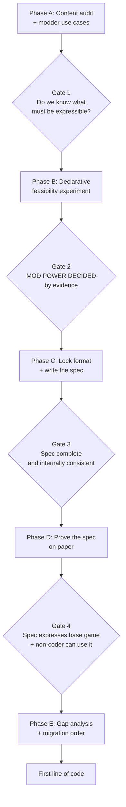

# Preparation Roadmap: Mod-Driven OnlyChess

**Status:** preparation phase. No implementation code until Gate 4.
**Goal of this phase:** produce a spec that provably expresses the existing game, so the refactor
has a target instead of a direction.

---

## ▶ START HERE — current status

**Last updated:** 2026-07-17 · commit `8568118` · branch `refactor/mod-driven-prep`

### Where we are

| Phase | State |
|---|---|
| **A** — audit + use cases | ✅ complete → [`content-audit.md`](content-audit.md), [`use-cases.md`](use-cases.md) |
| **Gate 1** | ✅ passed |
| **B** — feasibility experiment | ✅ complete → [`feasibility-study.md`](feasibility-study.md) |
| **Gate 2** | ✅ passed — mod power decided by evidence |
| **C** — lock format + spec | 🔶 **in progress — 4 of 6 done** |
| C1 format | ✅ [ADR-001](adr/001-data-format.md) — YAML, pinned to 1.2 core schema |
| C2 mod package | ✅ [spec/mod-package.md](spec/mod-package.md) — manifest, IDs, semver, load order |
| C5 conflict semantics | ✅ [ADR-002](adr/002-conflict-semantics.md) — addressable + 3 patch ops |
| C6 status model | ✅ [spec/status-model.md](spec/status-model.md) — statuses as data |
| **C3 content schemas** | ⬜ **← NEXT. The centerpiece.** |
| C4 loader lifecycle | ⬜ not started |
| **Gate 3 / D / E** | ⬜ not reached |

Decisions closed: D1–D7. Retired: D11. Still open: D8 (mostly settled in `mod-package.md`), D9, D10.

### Do this next: C3 — content schemas

One schema per content type, derived from the Phase A audit and Phase B verbs. **The status schema
is already done** (C6) — do not redo it.

Write: **piece**, **event**, **ability**, **fusion**, **board layout**, plus the shared **selector**,
**effect**, and **condition** vocabularies.

**Non-negotiable constraints — all are earned findings, not preferences. Violating any one of them
means the schema cannot express the base game:**

1. **Two selector axes** (F3) — `tag` ("contains a rook": Rook, Chancellor, Warden, **and**
   Inquisitor) and `primary` ("is primarily a rook": Rook, Chancellor, Warden, **not** Inquisitor).
   `gia_xang_tang` needs the second; abilities need the first. One axis cannot express both.
2. **Fusion is an ordered pair** (F10) — `(Rook, Bishop) → Warden` but `(Bishop, Rook) → Inquisitor`.
   Do not derive from a rule; the principle is only half-applied. Keep the explicit 6-entry table.
3. **Events are two-phase** (F9) — `my_danh_iran` computes its 2×2 zone at *warning* time and reads
   it at *execution*. Warning can bind state. **This is the only place bindings are needed — watch
   it closely, it is where the format would start becoming a language.**
4. **Events are a list of steps** — `mat_quyen_cong_dan` does two unrelated things.
5. **Transform needs a named `preserve` policy** (F4) — `all_except_identity` vs `[has_moved]`.
   Both exist today, unnamed, and they disagree about whether statuses survive.
6. **Shield-respect is a selector filter, not an engine rule** (F2) — `not_status: [base:shield]`,
   explicit per effect. Seven events ignore shields today; the schema makes that visible, not fixed.
7. **Pawn and King need opaque verbs** — `enpassant`, `castle`. Registered *by `base:chess`* through
   the public verb path, never engine special-cases. If that path is privileged, dogfooding is a lie.
8. **The condition line holds** — pure predicates. No loops, no assignment, no arithmetic beyond
   comparison. See `CLAUDE.md`.
9. **Verbs are earned** — only what base-game content actually needs. No `modify_property`, no
   `grant_ap`, no counters. Those arrive via code mods.

Then C4 (loader lifecycle + error contract), then Gate 3.

### Context a fresh session needs

- `CLAUDE.md` is committed and loads automatically — it carries the constitution, the mod model, and
  the condition line. Trust it over any older doc.
- The **existing `docs/*.md`** (`oop-design.md`, `extensibility-and-change-impact.md`, …) describe
  the **pre-refactor** design and are gitignored/local. Accurate map of the *problem*; misleading map
  of the *target*.
- **UC13–15 (HP, conditional powers, missions) are probes, never features.** If you find yourself
  building one, stop and re-read `CLAUDE.md`.
- Tests: `python -m pytest` (**not** `uv run pytest`). 182 passing as of `8568118`.
- Uncommitted: `src/game/board.py` has a stray trailing-whitespace edit predating this work.

### Waiting on the human

- **Line up a non-coder for D3** (the non-coder test). Needs lead time. It is the only step that
  tests the project's actual goal rather than our belief about it.
- Two flagged close calls, open to challenge: ADR-002 ships 3 patch ops with **no base-game
  consumer**; ADR-001's YAML 1.2 pin adds a `ruamel.yaml` dependency to a project that currently
  depends only on pygame.

---

## How to use this document

Work top to bottom. The gates are real: each one exists because the work after it is expensive to
redo if the answer changes. Steps inside a phase can be reordered; the research backlog runs in
parallel and is unblocked today.

This roadmap covers preparation only. It ends where the first line of engine code begins.

## The guiding constraint

From `CLAUDE.md`: **the base game is a mod**, and we **build the smallest engine that runs it**.

Both cut the same way here — the base game is the spec. We are not designing a modding system for
imagined future modders. We are designing the minimum system that can express OnlyChess as it
exists today, then checking that a stranger could use the same system to add something new.

## Critical path

The one open decision from `CLAUDE.md` — how much power non-coders get — is **not settled by
debate**. It is settled by trying to express the existing content as data and seeing what resists.
Everything downstream waits on that finding.

---

## Phase A — Establish the target

### A1. Content audit (**L**) — the load-bearing step

Catalog every piece of content in the game today. For each, record what it actually *does*, in
mechanical terms rather than prose.

Surface to cover, as counted from the current source:

| Content | Count | Notes |
|---|---|---|
| Events | 10 | `src/events/`, pool listed in `src/game/mode_config.py` |
| Abilities | 4 | bishop_snipe (3 AP), knight_swap (2 AP), pawn_sprint (1 AP), rook_shield (3 AP) |
| Pieces | 10 | 6 standard + 4 fused (Archbishop, Chancellor, Warden, Inquisitor) |
| Fusion pairs | 6 | `src/fusion/rules.py` |

For each event, decompose into: **trigger** (when), **selector** (what it targets), **effect**
(what changes), **duration** (how long), **expiry** (what undoes it), **messaging** (what the
player is told).

**Done when:** every event, ability, and piece has a mechanical decomposition, and the union of all
"effect" and "selector" verbs is written down as one list. That list is the capability surface —
the thing the mod API must be able to express.

**Known findings to fold in:**

- **Four ad-hoc statuses exist**: poison (`kho_ga_tron_ba_mia`), immobilize
  (`nguoi_chong_bat_luc`), stun (`viec_nhe_vol_cao`), shield (`rook_shield`). All are
  "apply to piece → tick → expire", implemented four separate times via loose attributes
  (`piece.poisoned_turns`, `getattr(target, "is_shielded", False)`). This is the strongest
  candidate for a first-class system.
- **Fusion is asymmetric and deliberately so**: `(Rook, Bishop) → Warden` but
  `(Bishop, Rook) → Inquisitor`. Capture direction is meaningful. Any schema that models fusion as
  an unordered pair silently breaks the game.
- **Movement is already primitive-based**: `_get_sliding_moves(directions, limit)` and
  `_get_one_step_moves(directions)` in `src/pieces/base.py`. Data-defined pieces are close to free.
- **Events split into two shapes**: durational (poison/immobilize/stun) vs instant (the other
  seven). Confirm during the audit — it likely means two schemas, not one.

### A2. Modder use cases (**M**)

Write the stories the design must satisfy, ordered by how much we care. Without these, the spec is
guesswork dressed as architecture. Suggested spread, to be argued with:

- *Tuner*: "make the queen's ability cost 2 AP instead of 3"
- *Content adder*: "add a piece that moves like a knight but leaps three squares"
- *Content adder*: "add an event that freezes a random enemy piece for two turns"
- *Reskinner*: "use my own sprites and sounds"
- *Rule bender*: "make fusion require two captures instead of one"
- *Total converter*: "turn this into shogi"

For each: who writes it, what files they touch, and — honestly — whether they need to understand
code. The total-conversion case is the stress test; the tuner case is the one that must be
trivially easy or the "non-coder" goal is not met.

**Done when:** each use case is traced to the content types it would touch, and any use case the
audit says is impossible is either dropped or flagged as an engine requirement.

> ### Gate 1
> We know the complete capability surface and who we are building for.
> **Do not start Phase B without A1.** The experiment is only meaningful against a full inventory.

---

## Phase B — The decisive experiment

### B1. Declarative feasibility study (**L**)

For each of the 10 events, 4 abilities, and 10 pieces from the audit: **attempt to write it as
data.** On paper, in a scratch file, in any invented notation. No engine, no loader, no code.

Sort every item into one of three buckets:

1. **Trivially declarative** — expressible with obvious verbs
2. **Declarative with new verbs** — needs a primitive we do not have yet; record the primitive
3. **Resists declaration** — record *precisely why*

Bucket 3 is the whole point of the exercise. The reason an item resists is the specification for
the escape hatch. "Needs to inspect arbitrary board state" and "needs to run logic between two
other systems' hooks" imply very different answers.

**Done when:** every item is bucketed, bucket 2 has a consolidated verb list, and bucket 3 has a
written reason per item.

**Also required (added at Gate 1):** paper-sketch UC13 (HP), UC14 (conditional powers), and UC15
(missions) — *not to build them*, but to prove the shape holds. These are stated goals that the base
game does not exercise, so the audit cannot validate them. If the trigger → condition → effect shape
cannot express them on paper, it is the wrong shape, and that must be known before Phase C rather
than after the engine is built. See `use-cases.md` → "The unifying insight".

**Watch for the trap:** it is always possible to make data expressive enough to cover bucket 3 by
adding conditionals, variables, and loops to the format. That is inventing a programming language
with bad ergonomics and no debugger. If bucket 3 pushes the format that way, the honest answer is
an escape hatch, not a richer DSL.

### B2. Decide the mod power ceiling (**S**)

Read B1's buckets and answer the open question from `CLAUDE.md`. The evidence, not taste, picks:

- Bucket 3 empty → pure declarative data is viable
- Bucket 3 small (1–3 stubborn items) → data + a narrow escape hatch
- Bucket 3 large (half the content) → the declarative layer is a facade; rethink the split

**Done when:** recorded as an ADR, and the "Open decisions" section of `CLAUDE.md` is updated or
deleted accordingly.

> ### Gate 2
> **The mod power question is answered with evidence.** This unblocks every schema decision.
> The trust model follows immediately: if mods can ship code, the model is trusted-local-install
> and is documented as such. Python cannot be meaningfully sandboxed — do not attempt one.

---

## Phase C — Lock the format and write the spec

### C1. Choose the data format (**S**)

Decide before writing schemas; the schemas are hard to port afterward. Weigh for a **non-coder
author**, not for us:

- **JSON** — universal, zero ambiguity, **no comments** (a real cost when the audience is
  non-coders who need to annotate and explain their own files)
- **TOML** — comments, forgiving syntax, weak for deep nesting
- **YAML** — comments, human-friendly, but whitespace-significant and full of foot-guns
  (the Norway problem, tabs, surprising coercions)

**Done when:** an ADR records the choice and the nesting depth the schemas actually need — which
comes from Phase B, not from preference.

### C2. Mod package spec (**M**)

- Folder layout; `manifest` schema (id, version, display name, author, description, dependencies)
- **Namespaced IDs** (`base:queen`, `mymod:dragon`) — the exact grammar, reserved prefixes, and
  what happens on collision
- Semver policy: what a MAJOR bump means, when the loader auto-disables a mod
- Dependency declaration, load order derivation, **cycle detection** (A→B→A must fail with a clear
  message, not a crash)

### C3. Content schemas (**L**)

One schema per content type, derived from the Phase A audit and Phase B verbs: piece, event,
ability, fusion rule, board layout, tuning. Must preserve fusion's directional asymmetry.

### C4. Loader lifecycle spec (**M**)

The pipeline, stage by stage: discover → parse → validate → resolve dependencies → order →
register → activate. Define what a failure does at each stage.

Pin down the **error contract**: every content error names mod id, file, field, and expectation.
The person reading it does not read Python. This is a spec deliverable, not a polish task.

### C5. Conflict and override semantics (**M**) — the underestimated one

Two mods modify the same thing. What happens?

This is where "everybody can extend" either works or collapses into a mod-manager nightmare, and it
is the question most likely to be discovered too late. Options span last-wins, explicit patch
operations (RimWorld's approach), and merge-friendly additive structures (Minecraft's tags). The
answer constrains C3's schemas, so it cannot be deferred past Phase C.

### C6. Status effect model (**M**)

Design the first-class system that replaces the four ad-hoc statuses. Must cover poison,
immobilize, stun, and shield as *data*, and let a mod define a fifth without engine changes.

> ### Gate 3
> The spec is complete and internally consistent. Every capability from the Phase A surface has a
> home in a schema.

---

## Phase D — Prove the spec before building it

### D1. Write the base mod on paper (**L**)

Hand-write the actual content files for the entire base game against the spec. No loader, no
engine, no validation — just the files as a modder would write them.

This is the cheapest possible test of the dogfooding decision. Anything about the base game the
spec cannot express is found here, in a text editor, rather than three weeks into an engine
refactor built on the wrong schema.

**Done when:** all 10 events, 4 abilities, 10 pieces, 6 fusion pairs, and the board layout exist as
data files, with every gap logged.

### D2. Base mod granularity — **DECIDED: split**

**Split into `base:chess`, `base:fusion`, `base:events`.** Gate 1 made vanilla chess (UC11) a
requirement, which decides this: disabling `base:events` must yield a playable standard chess game.

Convenient side effect — the base game now exercises the dependency resolver itself
(`base:fusion` depends on `base:chess`), and total conversion (UC12, now a stated goal) becomes a
matter of replacing `base:chess` rather than forking the engine.

Remaining work here is defining the inter-mod boundaries, not deciding whether to split.

### D3. The non-coder test (**M**) — the only real validation

Draft a short modder guide from the spec. Hand it to an actual person who does not write code, with
one task: *add a new piece and a new event.* On paper is fine.

If they cannot, the spec has failed its stated goal, and that is worth knowing now rather than
after the engine is built. This is the only step that tests the actual project goal rather than our
belief about it. Everything else tests internal consistency.

> ### Gate 4
> The spec expresses the entire base game, and a non-coder can author content from the guide alone.
> **Code may begin.**

---

## Phase E — Plan the refactor (spec-blocked, plan-only)

### E1. Engine gap analysis (**M**)

What in `src/` blocks the spec. Three blockers are already known (see `CLAUDE.md` "Current state"):
import-time registration, identity in `src/constants.py`, no status system. Confirm against the
finished spec and find the rest — `GameState` ownership and the `finish_ability_turn` /
`run_post_move_systems` split are the likely candidates, per
`docs/extensibility-and-change-impact.md`.

### E2. Migration order (**M**)

Sequence the refactor so the game stays runnable and the tests stay green throughout. Strong
candidate ordering, to be validated by E1:

1. Status effect system (self-contained, immediate cleanup win, no loader dependency)
2. Namespaced IDs replacing `src/constants.py` codes — **including board dimensions and starting
   layout**, promoted to the first wave because total conversion (UC12) is now a stated goal
3. Loader + registry population, replacing import-time registration
4. Migrate content types to data, one at a time, base mod last-to-first
5. Delete the old hardcoded paths once nothing uses them

Define the **walking skeleton**: the thinnest end-to-end slice that loads one trivial mod and puts
one piece on the board. Build it first; it de-risks everything after.

---

## Research backlog (parallel, unblocked)

Runs alongside Phases A–B. Prior art first — these problems are solved, and the failure modes are
documented by people who hit them at scale.

| Topic | Why it matters | Priority |
|---|---|---|
| **RimWorld** Defs + XML PatchOperations | Closest analogue: OOP game, content-as-data, huge non-coder scene, C# escape hatch. Directly informs C5. | **High** |
| **Factorio** data stage + prototypes | Base game as mods, done at scale. Directly informs D2. | **High** |
| **Minecraft** data packs, predicates, tags | Declarative trigger→effect; tags are the merge-friendly answer to C5. | **High** |
| **MtG Forge / card DSLs** | Non-coders authoring "trigger + effect + duration" cards. Nearest thing to your events. | **High** |
| **Dota 2** data-driven abilities | Already surveyed; go deeper on where the data model gave out and why. | Medium |
| Format ergonomics for non-coders | Feeds C1. The comment question is the crux. | Medium |
| Python schema validation (pydantic v2 vs jsonschema) | Feeds C4's error contract. Error *quality* is the criterion, not speed. | Medium |
| Pygame hot-reload feasibility | Iteration speed for modders. Nice-to-have; do not let it shape the spec. | Low |
| Asset loading from mod folders | Sprites/sounds from arbitrary paths; `src/ui/assets.py` currently builds fixed paths. | Low |

**Read prior art for failure modes, not features.** What did they regret? What could they never
change afterward? Those answers are worth more than their feature lists.

---

## Decisions to record

Keep these as ADRs in `docs/modding/adr/`. Each is expensive to reverse once schemas exist.

| # | Decision | Gated on |
|---|---|---|
| ~~D1~~ | ~~Mod power ceiling~~ | **decided: data-first, code registers verbs** (Phase B) |
| ~~D2~~ | ~~Trust model~~ | **decided: trusted local install, no sandbox** (Phase B) |
| ~~D3~~ | ~~Data format~~ | **decided: YAML 1.2 core schema** ([ADR-001](adr/001-data-format.md)) |
| ~~D4~~ | ~~ID and namespace grammar~~ | **decided: `namespace:name`, lowercase** ([mod-package](spec/mod-package.md)) |
| ~~D5~~ | ~~Conflict/override semantics~~ | **decided: addressable + 3 patch ops** ([ADR-002](adr/002-conflict-semantics.md)) |
| ~~D6~~ | ~~Status effect model~~ | **decided: data statuses, 2 expiry policies** ([status-model](spec/status-model.md)) |
| ~~D7~~ | ~~Base mod granularity~~ | **decided at Gate 1: split** (UC11) |
| D8 | Versioning and compatibility policy | — |
| D9 | Trigger/condition/effect vocabulary — the v1 verb set | Phase B |
| D10 | Open piece properties | Phase B |
| ~~D11~~ | ~~Fusion on capture or on kill, once HP exists~~ | **retired** — HP is a probe, never built; whoever adds it decides |

## Document inventory

Written as the phases produce them — not up front.

- `docs/modding/roadmap.md` — this file
- Phase A → `content-audit.md`, `use-cases.md`
- Phase B → `feasibility-study.md`
- Phase C → `spec/mod-package.md`, `spec/content-schemas.md`, `spec/loader-lifecycle.md`
- Phase D → `mods/base/**` (data files), `modder-guide.md`
- Phase E → `engine-gap-analysis.md`, `migration-plan.md`
- Ongoing → `adr/`

The existing `docs/*.md` describe the **pre-refactor** design. They are an accurate map of the
problem and a misleading map of the target. Do not update them mid-refactor; retire or rewrite them
in Phase E once the target is real.

## Explicitly not doing yet

Named here so they do not creep in: mod distribution or workshop integration, an in-game mod
manager UI, hot reload, sandboxing (impossible in Python — see Gate 2), multiplayer or netcode,
performance optimization, and localization of mod content.

Any of these may be worth doing later. None of them are preparation, and each would expand the
engine past "smallest thing that runs the base game as a mod."
