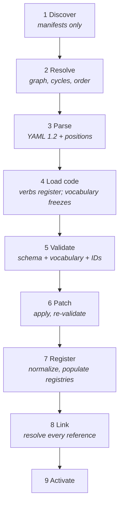

# Spec — Loader Lifecycle

**Status:** draft (roadmap C4). The last Phase C deliverable before Gate 3.
**Depends on:** [ADR-001](../adr/001-data-format.md) (YAML 1.2 chokepoint),
[ADR-002](../adr/002-conflict-semantics.md) (patch ordering), [mod-package.md](mod-package.md)
(manifests, IDs, dependency graph), [content-schemas.md](content-schemas.md) (what gets validated).

Two deliverables: **the pipeline**, stage by stage, with what failure does at each; and **the error
contract**, which is a spec deliverable rather than a polish task because the person reading the
message does not read Python.

The requirements come straight from `CLAUDE.md`:

- **Registries are populated by the loader at runtime**, never by import side effects.
- **Fail loud, with attribution** — mod id, file, field, expectation.
- **Validate at load, not at use** — no `KeyError` twenty turns in.
- **Never silently skip malformed content** — a mod that half-loads is worse than one that refuses to.

---

## The pipeline



### The ordering is not the roadmap's, and the difference matters

The roadmap sketches *discover → parse → validate → resolve dependencies → order → register →
activate*. **Resolve must move before validate**, because of a dependency chain the sketch does not
show:

> Validation needs the **verb vocabulary** (is `type: drop` a real move type?).
> The vocabulary is not complete until **code mods have registered their verbs**.
> Code mods must run in **dependency order**.
> Dependency order comes from **resolve**.

So `resolve → load code → validate`, and validating before resolving is not a style preference — it
is impossible. Anything validated earlier would be checked against a vocabulary that is still
missing verbs, and every `castle:` in `base:chess` would fail as an unknown key.

This is the loader-shaped consequence of Phase B's decision (*content is data; code adds verbs*). It
is worth stating loudly because the naive pipeline looks right and fails only for code mods — which
means it would pass every test written against `base:chess` alone, until the first third-party verb.

Two smaller ordering constraints, each load-bearing:

- **Parse before load code.** Parsing needs no verbs, so it costs nothing to do first — and it means
  a syntactically broken mod is rejected *before* we execute anyone's Python. Under a trusted local
  install (ADR-001, mod-package.md) this is the only free safety we get. Take it.
- **Patch before normalize.** ADR-002 makes *author-facing field names* the patch targets, so patches
  must land while the data still looks like what the author wrote. Normalizing first would mean a
  patch setting `limit: 3` collides with an already-converted `4`, and would "work" while being
  wrong. See [Register](#7-register).

---

## Stages

### 1. Discover

Scan the mod directory. Read **`manifest.yaml` only** — no content files yet, because we do not yet
know which mods are enabled and must not report errors from a mod that is about to be disabled.

| Failure | Response |
|---|---|
| No `manifest.yaml` | Not a mod. Ignore silently — this is the one silent skip in the loader, and it exists so a stray `README/` or `.git/` is not an error. |
| Manifest unparseable / missing required field | Report; mod is disabled. Attribution falls back to the **folder name** — the namespace is exactly what we failed to read. |
| `code: false` but a `code/` directory exists | Hard error (mod-package.md). Not a warning: the manifest's honesty is the whole trust model. |

### 2. Resolve

Everything in mod-package.md's "Dependencies and load order", enforced here.

| Failure | Response |
|---|---|
| Two mods claim one namespace | Hard error naming **both** mods and the namespace. Never a merge. |
| Dependency cycle | Hard error naming the **full cycle** (`a → b → c → a`). Load-bearing for correctness, not just diagnostics — ADR-002's patch order is only deterministic on an acyclic graph. |
| Required dependency missing | Mod disabled; dependents disabled transitively, with the chain reported. |
| Dependency MAJOR mismatch | Mod disabled (mod-package.md). |
| Optional dependency absent | No effect, no error. Present → ordered after it. |

**Output:** an ordered list of enabled mods. Ties break by namespace, alphabetically.

### 3. Parse

Read every content file of every enabled mod through **one chokepoint module**.

ADR-001 is explicit that the YAML 1.2 pin is load-bearing and easy to lose: someone will eventually
`import yaml` out of habit and silently reintroduce 1.1's Norway problem. **The chokepoint must
actively reject stock PyYAML**, not merely avoid it. That check belongs here, in the loader, where
it is one assertion.

| Failure | Response |
|---|---|
| YAML syntax error | Mod disabled. Report `file:line:col` — the parser already knows both. |
| File is not a mapping / has no `type` | Mod disabled. `type` is what makes folders cosmetic (mod-package.md). |
| Unknown `type` | Mod disabled, listing the known types. |

**Parse also captures source positions.** See [Source positions](#source-positions-the-constraint-that-decides-the-library).

### 4. Load code

For mods with `code: true`, in dependency order, import `code/__init__.py` and let it register verbs
through the public verb path.

**This is the stage that makes or breaks the dogfooding claim.** `base:chess` registers `castle` and
`enpassant` here, through exactly the path a third-party mod uses. There is no earlier hook, no
privileged pre-registration, and no engine-side default vocabulary that content cannot also reach.
If a reviewer finds core registering a verb outside this stage, that is the bug.

| Failure | Response |
|---|---|
| Exception during import/registration | Mod disabled + dependents. Report the mod id and the traceback — this reader *does* write Python. |
| Verb name collision | Hard error naming both mods and the verb. Verbs are namespaced like everything else. |
| A `code: false` mod's file declares an unregistered verb | Not detected here — it surfaces at [Validate](#5-validate) as an unknown verb. |

**At the end of this stage the vocabulary freezes.** Nothing may register a verb afterward; a verb
appearing later would mean content validated against an incomplete vocabulary, which is the
`KeyError`-at-turn-20 failure wearing a hat.

### 5. Validate

Every definition against its schema (content-schemas.md) and the frozen vocabulary.

| Failure | Response |
|---|---|
| Unknown key | Error. **The highest-value rule in the loader** — it turns `limt: 3` from silent wrong behaviour into a message. C3 leans on it. |
| Missing required field | Error, naming the field and why it has no default (e.g. `preserve`, which has none on purpose — F4). |
| Wrong type / value outside an enum | Error, listing the valid values. |
| Unknown verb | Error, listing registered verbs of that kind. If a mod ships the verb but is disabled, **say so** — "`mymod:drop` is registered by `mymod`, which is disabled" beats "unknown move type". |
| ID malformed (uppercase, bad charset) | Error (mod-package.md). Lowercase is enforced, not encouraged. |
| ID defined outside the mod's own namespace | Error naming both namespaces. |
| Duplicate ID | Error naming both files. Cross-file, so it lives here rather than in parse. |

### 6. Patch

Apply `set` / `add` / `remove` in dependency order (ADR-002), then **re-validate every touched
definition**.

| Failure | Response |
|---|---|
| Target ID does not exist | Error, blaming the **patching** mod. |
| Path does not resolve | Error, blaming the patcher, naming the path and the target. |
| Two mods patch the same path | **Later wins, and the loader says so** — naming both mods, the target, and the field. Not an error; not silent either (ADR-002). |
| Patch produces invalid content | Error blaming the **patch**, not the original author. |

**Why re-validate, and why attribution flips.** A patch can turn valid content invalid — `remove` a
required field, `set` a bad enum. Validating only once, after patching, would report a modder's own
typo through a lens of someone else's patch, and blame the wrong person. Validating only before
patching would miss patch-induced breakage entirely. Both passes are needed, and each blames whoever
last touched the field.

### 7. Register

Normalize author-facing data into engine form, then populate the registries.

**This is where `CLAUDE.md`'s "registries are populated by the loader at runtime" becomes real**, and
where today's anti-pattern dies. See [What this deletes](#what-this-deletes).

Normalization is where the loader pays for the schema being author-facing rather than
engine-facing:

- **`limit: 3` → internal `4`** (C3, finding 5 — `_get_sliding_moves` uses `range(1, limit)`). The
  loader owns this conversion. It is the one place it can live without either lying to the author or
  leaking an off-by-one into every content file.
- **Unqualified IDs → qualified** (`queen` → `base:queen`, resolved against the *current mod's*
  namespace, per mod-package.md).

| Failure | Response |
|---|---|
| Normalization fails | Should be unreachable — validate ran first. If it fires, it is an **engine bug**, not a content error, and must say so rather than blaming the modder. |

### 8. Link

Resolve every cross-reference: `into: base:queen`, `status: base:poison`, `members: [...]`,
`components: [...]`, fusion's `capturer`/`captured`/`into`, the board layout's piece and side IDs.

**This stage is the entire point of "validate at load, not at use."** A dangling `into: base:qeen`
is a `KeyError` on the turn the event finally fires — possibly turn 40, possibly in someone else's
game, possibly never in testing. Here it is a message before the window opens.

| Failure | Response |
|---|---|
| Reference to an unknown ID | Error naming the referring file/field and the missing ID. **Include a did-you-mean.** |
| Reference into a disabled mod | Error naming the disabling reason — this is a dependency bug, and the honest message is "you referenced `base:poison`, which belongs to `base:events`, which is disabled", not "unknown status". |

### 9. Activate

Hand the populated registries to the game.

**The engine's only structural requirement: at least one board layout is registered.** A game with
no board cannot start.

Note what this deliberately is *not*: a requirement that `base:chess` loaded. Core may never name a
mod (`CLAUDE.md`, prime directive), so "the base game is missing" is not a thing the engine can
say — nor should it, since a total conversion (UC12) replaces `base:chess` outright and must still
boot. The engine requires a *board*, not a *specific* board.

| Failure | Response |
|---|---|
| Zero board layouts registered | Refuse to start, reporting the **root cause**, not the symptom. See below. |

---

## Failure policy

Two rules, both from `CLAUDE.md`, both with teeth.

### A mod with any error is disabled whole

Never half-loaded. A chess mod that loads every piece except the queen is worse than one that
refuses — it produces a game that looks fine and is wrong, and the player has no way to know.

### All errors are collected, then reported together

**Not fail-fast.** The loader runs every stage to completion over every mod, gathers every error, and
reports them in one pass.

This is an ergonomics requirement, not a nicety: fail-fast means a non-coder with six typos runs the
game six times, and each run tells them about one. That loop is the difference between a modding
system someone uses and one they abandon. The exceptions are the stages that make later stages
meaningless — a cycle (2) or a frozen-vocabulary failure (4) stops the pipeline, because everything
after would produce cascade noise.

### Report the root, not the cascade

If `base:chess` has one typo, it is disabled; `base:fusion` and `base:events` are disabled as
dependents; zero board layouts register; the game will not start.

**Four errors, one cause.** The report leads with the typo. The cascade is shown as a consequence,
indented, and never as four peer-level errors — a modder who sees "no board layouts registered" at
the top will go looking in the wrong file. This is the single most likely way a good error contract
still produces a bad experience.

---

## The error contract

Every content error carries **mod id · file · line:col · field path · what was wrong · what was
expected**. No exceptions — an error missing any of these is a bug in the loader.

```
ERROR  base:events  events/tai_xiu.yaml:12:5
  field:     execute[0].filter.not_stat
  problem:   unknown key 'not_stat'
  expected:  one of is, not, color, friendly, tag_any, primary,
             has_status, not_status, empty
  did you mean 'not_status'?
```

**The reader does not write Python.** That single fact rules out a stack trace, a type name
(`ValidationError`, `NoneType`), a schema fragment, and the word "deserialize". It also rules out
being terse: `expected` must list the valid options, because a modder cannot look them up in a
registry.

### Did-you-mean is a requirement, not a nicety

Levenshtein against the valid key set, suggested at distance ≤ 2. For this audience it is plausibly
the highest-value feature in the loader: the dominant non-coder error is a misspelling, and the
difference between "unknown key `not_stat`" and "did you mean `not_status`?" is the difference
between a fixed file and a closed tab.

It costs ~15 lines against a key set we already have, and it applies at three stages — unknown key
(5), unknown verb (5), and unknown ID reference (8).

### Warnings are not errors, and there are few

Only ADR-002's same-field patch collision warns. Everything else is an error or is fine. A loader
that warns liberally trains people to ignore warnings, and the one warning that matters gets lost —
which is exactly the silent-breakage failure ADR-002 exists to prevent.

---

## Source positions — the constraint that decides the library

The contract above promises `file:line:col`. **Nothing gives us that for free**, and this is the
finding that should drive the library choice rather than the usual criteria.

Validators — pydantic, jsonschema — validate a **parsed structure**. By then the YAML source
positions are gone: a `dict` does not know it came from line 12. So the error path they produce
(`execute[0].filter.not_stat`) has to be mapped **back** to a position, which requires:

1. Parsing with a loader that **retains positions** — `ruamel.yaml`'s round-trip mode returns
   `CommentedMap`/`CommentedSeq` carrying `.lc` line/column data. Plain-dict parsing discards it
   irrecoverably.
2. Keeping those position-bearing objects **through validation**, rather than converting to plain
   dicts on the way in.
3. A **resolver** that walks a field path against the position-bearing tree to recover line:col.

None of that is exotic, but it is architecture, not a flag — retrofitting positions onto a loader
that parses to plain dicts means re-parsing every file at error time and re-deriving what was
thrown away. **Decide it before the loader is written**, which is the whole reason this is in the
spec and not in the code.

> ⚠️ **Unspiked.** `ruamel` is not installed (the project's only declared dependency is `pygame`),
> and Gate 4 forbids implementation code, so **the `.lc` mapping is specified but unverified**. It
> is the highest-risk unknown in this document. First thing to test in E's walking skeleton: parse
> a nested mapping round-trip, and recover line:col for a key three levels down.

## Validation library — criteria, and why the obvious answers do not fit

The research backlog frames this as *pydantic v2 vs jsonschema*, with error quality as the criterion.
Writing the contract suggests the framing is off. Four constraints, in the order they bite:

| # | Constraint | Consequence |
|---|---|---|
| 1 | **Source positions** (above) | Neither library helps. Solved by the parser and a resolver, whichever validator wins. |
| 2 | **The vocabulary is runtime-extensible** | Code mods register verbs at stage 4, so `effect` is a discriminated union over a registry that does not exist at import time. jsonschema (schema-as-data) builds this naturally; pydantic needs `create_model` gymnastics against a moving target. |
| 3 | **All errors, not the first** | Both support it. Not a discriminator. |
| 4 | **We write our own message layer regardless** | jsonschema's `anyOf` errors ("is not valid under any of the given schemas") are unusable for this audience; pydantic v2's are better but still Python-shaped (`Input should be a valid string`). Either way we translate. |

**Constraint 4 dissolves the criterion the backlog picked.** If we translate every message anyway,
the library's native message quality barely matters — which means "error quality" cannot decide this,
even though error quality is genuinely the goal.

What is left for a library to do is structural checking against a schema we build at runtime — and by
stage 4 **the verb registry is already that schema** (verb name → parameter spec). A validator driven
directly off the registry is therefore a real third option the backlog does not list: total message
control, no dependency beyond the parser, and a natural fit for constraint 2, at the cost of writing
and maintaining the walk.

**Recommendation: do not decide here.** Pin the contract (above), record the constraints, and settle
the library in **ADR-003 during Phase E**, after the `.lc` spike — because the spike's result is a
real input, and deciding without it would be picking on vibes. What C4 *does* settle: **the contract
is the requirement, and the library serves it.** Any candidate that cannot produce the error block
above is disqualified regardless of its other merits.

---

## What this deletes

The three blockers in `CLAUDE.md`'s "Current state" are loader problems, and stage 7 is where the
first one dies.

**Today, registration is a core edit** — the anti-pattern named in `CLAUDE.md`:

```python
# src/events/registry.py
def register_event(event_class):
    _EVENT_REGISTRY[event_class.event_key] = event_class   # fires on import…

# src/events/__init__.py — …and imports are a hardcoded list a modder cannot touch
from .comeout import Comeout
from .gia_xang_tang import GiaXangTang
# … 8 more
```

Abilities are the same shape (`@register_ability` + an import list). Pieces are blunter still —
`_PIECE_REGISTRY` is a **literal dict** in `src/pieces/registry.py`, so adding a piece is a core edit
with no registration hook at all. And `DEFAULT_ADVANCED_EVENT_POOL` in `mode_config.py` is a
hardcoded list of ten strings, which C3 replaces with the `event_pool` content type.

After C4, all four are stage 7 output: the registries are empty at import and populated by the
loader from mod data. `src/events/__init__.py`'s import list, `@register_event`, `@register_ability`,
and the `_PIECE_REGISTRY` literal all go away.

**One more, quieter:** `get_ability(key)` and `get_event_class(key)` raise `KeyError` on a missing
key today — the exact failure `CLAUDE.md`'s *validate at load* invariant names. Stage 8 makes them
unreachable, because a dangling reference cannot survive load. Logged for E1.

---

## Open

- **Which board layout does a session use?** Stage 9 requires ≥1 registered; it does not say which is
  active when two mods offer one. That is mode selection, and `mode_config.py` is its ancestor. Needs
  an owner in Phase D — it is the last thing standing between the loader and a running game.
- **Is `code/__init__.py` importable as a package, or exec'd from a path?** Mods live outside
  `sys.path`. Affects whether a code mod can `import` its own submodules, which it will want to.
  Mechanical, but it shapes the folder contract in mod-package.md.
- **Reload.** The pipeline is specified as one-shot at startup. Hot reload is explicitly out of scope
  (roadmap, "Explicitly not doing yet"), but the frozen-vocabulary rule at stage 4 is what would make
  it hard later. Noted, not solved.
- **Asset loading** is not in this pipeline. `sprite: base:sprites/warden` (C3) assumes an asset ID
  scheme that mod-package.md still lists as open. Assets probably need a stage between 7 and 9.
- **Does `engine:` gate the verb vocabulary or the loader contract?** Inherited from mod-package.md,
  and stage 4 sharpens it: they will version differently once code mods register verbs.

## Gate 3 readiness

With C4 done, Phase C is complete. Gate 3 asks whether the spec is internally consistent and whether
every Phase A capability has a home — content-schemas.md's checklist covers the second. Known gaps
carried into Gate 3, all deliberate and all recorded:

| Gap | Where | Status |
|---|---|---|
| Event triggers (F5) | content-schemas.md | Deferred out loud; v1 is pool-invoked only |
| Player choice (promotion) | content-schemas.md, finding 2 | **Real gap.** Needs a move-pipeline home |
| `credit` → fusion? | content-schemas.md | Recommendation recorded; human decides |
| Board layout selection | this doc | Needs an owner in Phase D |
| `.lc` position mapping | this doc | Unspiked; highest-risk unknown |
| Validation library | this doc | Deliberately deferred to ADR-003 (Phase E) |
